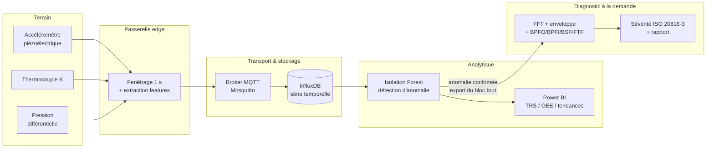

# Maintenance prédictive d'équipements tournants — pipeline IoT & diagnostic vibratoire

Chaîne complète de surveillance d'état de machines tournantes : acquisition capteurs → transport MQTT → stockage série temporelle → détection d'anomalies non supervisée → diagnostic vibratoire qualifié (FFT, analyse d'enveloppe, fréquences de défaut de roulement, sévérité ISO 20816-3).

Travail issu d'un projet de fin d'année de 8 semaines au **service Maintenance Industrielle & Digitalisation du Groupe OCP** (juin–août 2025), en double casquette développement et pilotage de projet.


---

## Périmètre de ce dépôt

Ce dépôt est une **ré-implémentation publique et autonome** de la chaîne de traitement conçue pendant le stage. Il ne contient **aucune donnée, aucun code et aucun secret appartenant au Groupe OCP** : les signaux sont générés synthétiquement par `scripts/generate_signal.py`, et les repères d'équipements (K201, B14…) sont des étiquettes de démonstration.

Les chiffres de performance cités plus bas ont été mesurés sur un **atelier pilote, périmètre restreint, sur la durée du stage**. Ils décrivent un contexte précis et ne constituent pas un benchmark généralisable.

---

## Le problème

Sur une installation lourde, un arrêt fortuit immobilise une ligne entière. La maintenance corrective subit la panne ; la maintenance préventive systématique remplace des organes encore sains et introduit des défauts au remontage. La maintenance prédictive vise le bon moment — mais suppose de savoir lire l'état réel de la machine.

Le verrou technique est là : un indicateur global (niveau vibratoire RMS) **ne détecte pas un écaillage naissant de roulement**. L'énergie du défaut est minuscule devant le balourd et le bruit de fond. Il faut aller la chercher là où elle est : dans la modulation d'amplitude d'une résonance haute fréquence.

La démo de ce dépôt le montre directement :

```
v_rms (mm/s)      1.626   -> zone A : Bon - surveillance normale   <- l'indicateur global ne voit rien
kurtosis         10.010                                            <- mais les impacts sont là
    73.00 Hz   amp=0.0882   -> BPFO x1 (ecart 0.07 %)              <- et le spectre d'enveloppe les nomme
```

Un défaut de piste extérieure parfaitement identifiable, sur une machine classée « bon état » par le seul niveau global.

---

## Architecture



**Deux niveaux volontairement séparés.** Le niveau 1 tourne en permanence sur tous les équipements instrumentés et répond à « est-ce que quelque chose a changé ? ». Le niveau 2 ne se déclenche que sur alerte et répond à « quoi exactement, et à quel point c'est grave ? ». Faire tourner l'analyse d'enveloppe en continu sur l'ensemble du parc serait à la fois inutile et coûteux.

### Deux décisions d'architecture qui comptent

**On ne publie pas le signal brut sur MQTT.** À 25 600 Hz, un seul capteur produit 25 600 valeurs/seconde ; publier échantillon par échantillon saturerait le broker et le réseau atelier. La passerelle bufferise le signal par fenêtres d'une seconde, calcule les indicateurs localement, et ne publie que ceux-ci (une dizaine de flottants par seconde). Le bloc brut ne remonte **qu'à la demande**, quand une anomalie est confirmée. Voir `src/ingestion/publisher.py`.

**Isolation Forest plutôt qu'un modèle supervisé.** Au démarrage, aucun historique de pannes étiqueté n'existait : impossible d'entraîner un classifieur. L'Isolation Forest s'entraîne sur des données nominales uniquement et isole ce qui s'en écarte. Le piège assumé et documenté dans le code : si la baseline contient déjà un défaut, ce défaut devient la norme. La sélection de la baseline doit être validée par le service maintenance, pas prise automatiquement.

---

## Démarrage

```bash
git clone https://github.com/rachid-bourjila/ocp-predictive-maintenance.git
cd ocp-predictive-maintenance
pip install -e .

# 1. Générer un signal avec défaut de piste extérieure (BPFO)
python scripts/generate_signal.py --fault bpfo --out data/k201_bpfo.csv

# 2. Diagnostic complet
python scripts/diagnose.py data/k201_bpfo.csv --speed 24.8 --bearing "SKF 6317"

# 3. Tests
pytest tests/ -q
```

Pour la chaîne temps réel (broker + base + collecteur) :

```bash
docker compose up -d              # Mosquitto + InfluxDB
python -m src.ingestion.publisher # passerelle simulée
python -m src.ingestion.collector models/detector.joblib
```

---

## Méthode

**Fréquences caractéristiques de défaut** (`src/diagnostics/bearing.py`) — pour un roulement de géométrie `(Z, d, D, α)` tournant à `fr` :

| Défaut | Formule | Ordre pour un SKF 6317 |
|---|---|---|
| BPFO — piste extérieure | `(Z/2)·fr·(1 − (d/D)cos α)` | 2,95 × fr |
| BPFI — piste intérieure | `(Z/2)·fr·(1 + (d/D)cos α)` | 5,05 × fr |
| BSF — bille | `(D/2d)·fr·(1 − ((d/D)cos α)²)` | 1,77 × fr |
| FTF — cage | `(fr/2)·(1 − (d/D)cos α)` | 0,37 × fr |

Ces ordres servent de garde-fou : un pic attribué à un BPFO doit tomber à ~2,95 × fr. Un écart d'un facteur 2 signale une harmonique, pas le fondamental — et un écart plus large signale une géométrie de roulement erronée dans le catalogue. `tests/test_diagnostics.py` verrouille cette plage.

**Analyse d'enveloppe** (`src/features/vibration.py`) — filtrage passe-bande 3–10 kHz autour d'une résonance de structure, démodulation par transformée de Hilbert, puis FFT moyennée de l'enveloppe. Le moyennage sur blocs recouvrants (Welch) est décisif : sans lui, les raies de défaut se confondent avec le plancher de bruit.

**Sévérité ISO 20816-3** — classement en zones A/B/C/D sur la vitesse vibratoire efficace, bande 10–1000 Hz. L'intégration accélération → vitesse est faite dans le domaine fréquentiel (`v(f) = a(f)/2πf`), plus stable qu'une intégration temporelle qui dérive.

---

## Résultats sur l'atelier pilote

| Indicateur | Avant | Après | Périmètre |
|---|---|---|---|
| Temps moyen d'analyse d'une anomalie | 4,5 h | 20 min | Atelier préparation, sur alerte |
| Défauts détectés avant arrêt machine | 30 % | 80 % | 18 équipements instrumentés |
| Temps de rédaction d'un rapport | 2 h | < 5 min | Génération automatisée |
| TRS atelier | 74 % | 81 % | Sur la durée du stage |

Un cas validé physiquement : un signal à kurtosis 8,4 sur une pompe centrifuge a conduit à un diagnostic de défaut de piste extérieure ; l'ouverture du palier lors d'un arrêt programmé a confirmé un écaillage naissant.

**Ce que ces chiffres ne disent pas.** Le TRS a bougé pendant une période où d'autres actions de maintenance étaient en cours — la part attribuable au système n'est pas isolée. Un pilote de 8 semaines sur 18 machines ne permet pas de conclure sur la durée.

---

## Pilotage

La partie non technique du projet, qui a pesé autant que le code :

- **Animation de réunions hebdomadaires** avec l'encadrante industrielle, les techniciens et ponctuellement le responsable d'atelier.
- **Registre de risques** tenu à jour — le risque réalisé a été la qualité dégradée du signal (faux positifs de l'Isolation Forest), traité par ajustement du taux de contamination et filtrage adaptatif.
- **Calibration terrain des seuils.** Les seuils d'alerte Power BI initiaux étaient théoriques ; les retours techniciens les ont ramenés à des valeurs réalistes. C'est ce qui a fait passer le taux de consultation des dashboards de 0 à un usage quotidien.
- **Analyse causale (5 Pourquoi)** sur le défaut confirmé : l'écaillage venait d'un désalignement résiduel, lui-même dû à l'absence d'alignement laser dans une gamme opératoire non mise à jour depuis 2018. La gamme a été révisée et les techniciens formés.

Détail en [docs/04-pilotage-projet.md](docs/04-pilotage-projet.md).

---

## Limites

- **Bruit industriel.** Les vibrations parasites des machines adjacentes et les variations de charge dégradent la sensibilité. Des techniques de débruitage (décomposition modale empirique, filtrage adaptatif) restent à évaluer.
- **RUL non validée.** Les modèles d'estimation de durée de vie résiduelle (linéaire, exponentiel, Weibull) demandent un historique de dégradation de plusieurs mois. Sur des équipements fraîchement instrumentés, aucune estimation n'est fiable — le code ne prétend pas le contraire.
- **Passage à l'échelle non testé.** Validé sur quelques dizaines d'équipements. Plusieurs centaines exigeraient de revoir le dimensionnement InfluxDB et la stratégie de rétention.
- **Géométrie des roulements.** Le catalogue embarqué est indicatif. Un nombre de billes erroné décale toutes les fréquences de défaut et invalide le diagnostic : la vérification au catalogue constructeur est un prérequis, pas une option.

---

## Piste explorée : couche de diagnostic en langage naturel (MCP)

Le diagnostic vibratoire reste un savoir-faire rare. Une piste explorée en prolongement du stage consiste à exposer ces outils d'analyse à un LLM via le **Model Context Protocol**, pour qu'un technicien puisse formuler sa demande en langage naturel pendant que le calcul reste déterministe et local.

Le projet open source de référence sur ce créneau est **[LGDiMaggio/predictive-maintenance-mcp](https://github.com/LGDiMaggio/predictive-maintenance-mcp)** (Luigi Gianpio Di Maggio, Politecnico di Torino), qui implémente exactement ce principe — FFT, enveloppe, détection de défauts de roulement, sévérité ISO 20816-3, données brutes conservées en local.

Cette couche **n'est pas implémentée dans ce dépôt**. Elle est citée comme direction, pas comme livrable.

---

## Stack

`Python 3.10+` · `NumPy` / `SciPy` · `scikit-learn` · `pandas` · `paho-mqtt` · `InfluxDB` · `Eclipse Mosquitto` · `Power BI` · `Docker`

## Structure

```
src/
├── config.py              # configuration, surchargeable par variables d'env
├── ingestion/
│   ├── publisher.py       # passerelle edge : fenêtrage + features + publication MQTT
│   └── collector.py       # abonné MQTT → InfluxDB → scoring → alerte
├── features/vibration.py  # RMS, kurtosis, facteur de crête, FFT, spectre d'enveloppe
├── diagnostics/bearing.py # BPFO/BPFI/BSF/FTF, zones ISO 20816-3, appariement de pics
└── anomaly/detector.py    # Isolation Forest + normalisation, sauvegarde/chargement
scripts/
├── generate_signal.py     # génération de signaux synthétiques sain / défaut
└── diagnose.py            # diagnostic bout-en-bout sur un CSV
tests/                     # 12 tests, dont un bout-en-bout injection → détection
docs/                      # architecture, pipeline, méthode vibratoire, pilotage
```

## Références

- ISO 20816-3:2022 — évaluation de la vibration des machines industrielles
- ISO 13374:2003 — architecture de traitement pour la surveillance d'état
- R. B. Randall, *Vibration-based Condition Monitoring*, Wiley, 2011
- F. T. Liu, K. M. Ting, Z.-H. Zhou, *Isolation Forest*, ICDM 2008
- A. K. S. Jardine, D. Lin, D. Banjevic, *A review on machinery diagnostics and prognostics*, MSSP 20(7), 2006

## Licence

MIT — voir [LICENSE](LICENSE).

## Auteur

**Rachid Bourjila** — élève-ingénieur, ENSGSI Nancy (Industrie 4.0 & Systèmes Intelligents) / Mines Rabat (Génie Informatique)
[LinkedIn](https://linkedin.com/in/rachid-b) · [GitHub](https://github.com/rachid-bourjila)
